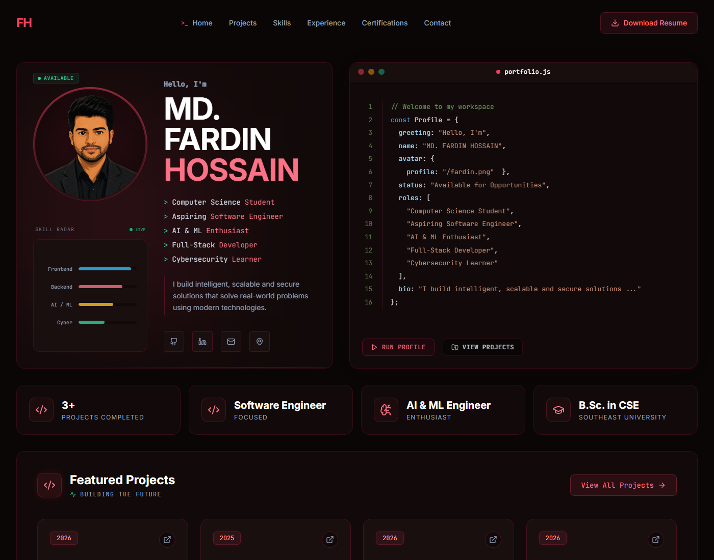

# Md. Fardin Hossain | Portfolio Website

<p align="center">
  
</p>

<p align="center">
  <a href="https://mdfardin.vercel.app/"><strong>Live Website</strong></a>
  &nbsp;|&nbsp;
  <a href="https://github.com/fardinhossain"><strong>GitHub</strong></a>
  &nbsp;|&nbsp;
  <a href="https://www.linkedin.com/in/fardinhosn"><strong>LinkedIn</strong></a>
  &nbsp;|&nbsp;
  <a href="mailto:fardin.hosn@gmail.com"><strong>Email</strong></a>
</p>

<p align="center">
  
  
  
  
</p>

## About This Project

This is my personal software engineering portfolio project. I built it to present my professional identity, skills, projects, certifications, GitHub analytics, contact information, and AI assistant in one responsive single-page website.

The portfolio is designed to feel like a developer workspace: dark interface, terminal-style interactions, animated profile sections, project cards, certification popups, and a compact AI chat widget.

## Highlights

| Feature | What it does |
| --- | --- |
| Hero profile and terminal | Introduces my profile with an animated terminal-style code panel. |
| Featured projects | Shows my main projects with stack tags, links, and hover preview images. |
| Skills dashboard | Organizes my technical skills by category for quick scanning. |
| Fardin's AI assistant | Lets visitors ask about my skills, projects, contact, and portfolio information. |
| GitHub analytics | Fetches live public repository data from the GitHub REST API. |
| Certifications | Displays verified certifications with responsive certificate image popups. |
| Contact terminal | Provides contact links and a secure email message form in a developer-themed section. |

## Tech Stack

| Area | Tools |
| --- | --- |
| Frontend | HTML5, CSS3, JavaScript ES modules |
| Build tooling | Vite, esbuild |
| Backend/API | Node.js, Express.js, Vercel and Netlify serverless functions |
| AI integration | OpenRouter API |
| Email delivery | Resend API |
| Data/API | GitHub REST API |
| Security | DOMPurify, Helmet, CORS, rate limiting, input validation |
| Deployment | Vercel |

## Key Improvements

- Added real project preview images for LocationKhuji and UniBuddy.
- Added clickable certification cards for C)PTE and EDGE-CUET certificates.
- Added a responsive animated certificate modal with Escape close, backdrop close, focus return, and scroll lock.
- Improved mobile behavior so project images and certificate popups remain readable on small screens.
- Updated source-control hygiene with ignored report artifacts and local document outputs.

## Project Structure

```text
My_Portfoilo/
|-- api/
|   `-- chat.js
|-- public/
|   |-- readme/
|   |   `-- portfolio-preview.png
|   |-- projects/
|   |   |-- locationkhuji.png
|   |   `-- unibuddy-app.png
|   |-- cpte_fardin.jpg
|   |-- EDGE-CUET.jpg
|   `-- Fardin_Hossain_Resume.pdf
|-- src/
|   |-- components/
|   |-- App.js
|   |-- data.js
|   |-- icons.js
|   |-- index.css
|   `-- main.js
|-- server.js
|-- vite.config.js
`-- package.json
```

## Run Locally

### 1. Clone the repository

```bash
git clone https://github.com/fardinhossain/MyPortfolio.git
cd MyPortfolio
```

### 2. Install dependencies

```bash
npm install
```

### 3. Configure environment variables

Create a `.env` file in the project root:

```env
OPENROUTER_API_KEY=your_openrouter_api_key_here
RESEND_API_KEY=your_resend_api_key_here
CONTACT_TO_EMAIL=fardin.hosn@gmail.com
CONTACT_FROM_EMAIL=Portfolio Contact <onboarding@resend.dev>
```

For production email delivery, verify a sending domain in Resend and replace `CONTACT_FROM_EMAIL` with an address on that domain. Add the same environment variables in the Vercel or Netlify project settings.

If the email API is not configured or is temporarily unavailable, the contact form automatically opens a prefilled message in the visitor's email app so the message is never lost.

### 4. Start the development server

```bash
npm run dev
```

Open `http://localhost:3000` in your browser.

### 5. Build for production

```bash
npm run build
npm start
```

## Security Notes

- API keys are kept on the server side through environment variables.
- Chat messages are validated and length-limited before reaching the AI provider.
- Contact messages are validated server-side, protected with a honeypot and rate-limited by the Express server.
- Dynamic chat output is sanitized with DOMPurify before rendering.
- The Express server includes Helmet, CORS, and rate limiting.
- `.env` and generated report files are ignored by Git.

## Contact

**Md. Fardin Hossain**  
Software Engineering Portfolio  

- Email: [fardin.hosn@gmail.com](mailto:fardin.hosn@gmail.com)
- GitHub: [github.com/fardinhossain](https://github.com/fardinhossain)
- LinkedIn: [linkedin.com/in/fardinhosn](https://www.linkedin.com/in/fardinhosn)
- Live website: [mdfardin.vercel.app](https://mdfardin.vercel.app/)
